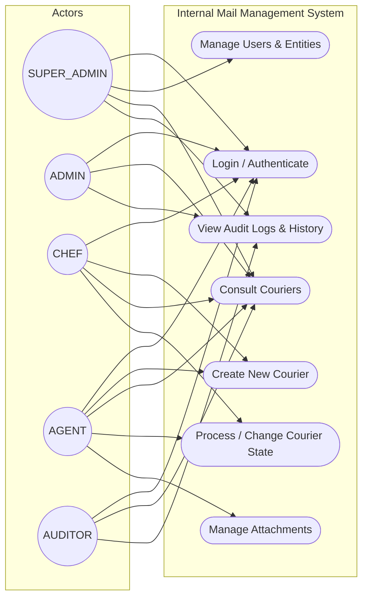
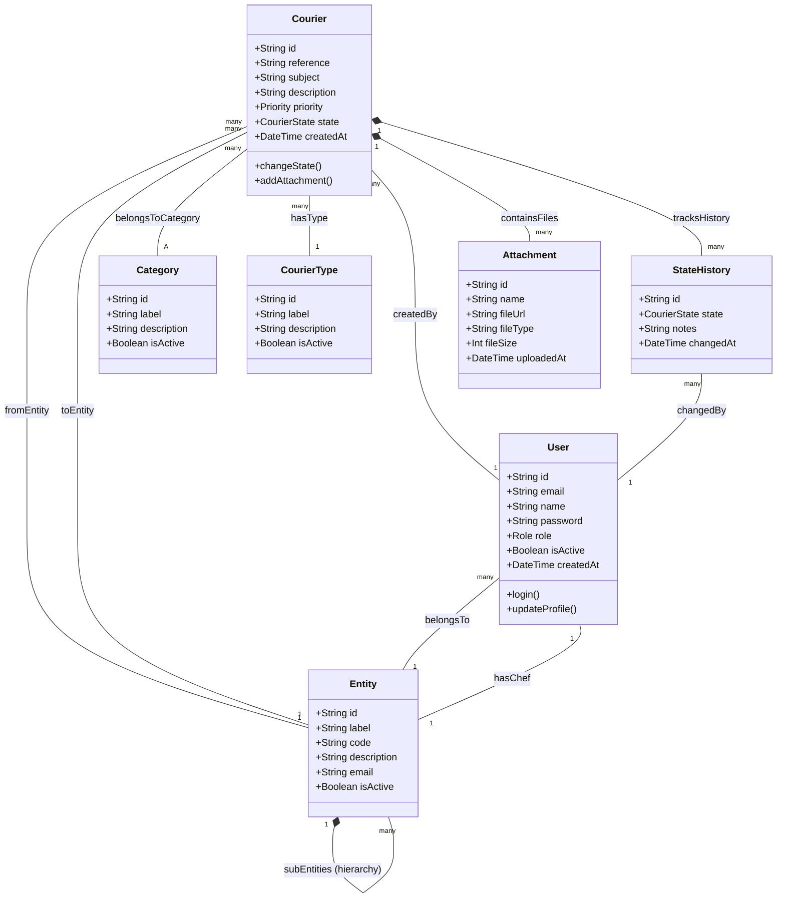
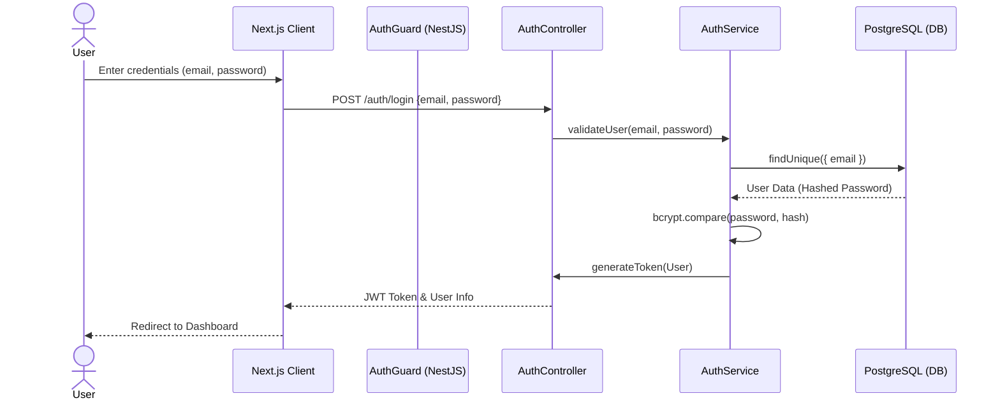
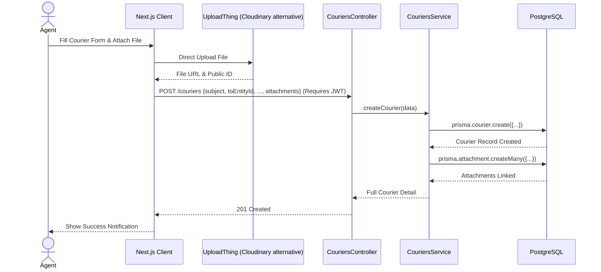
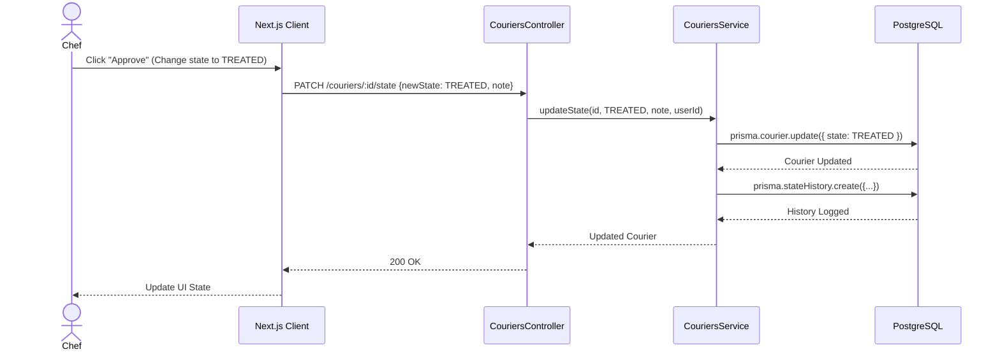
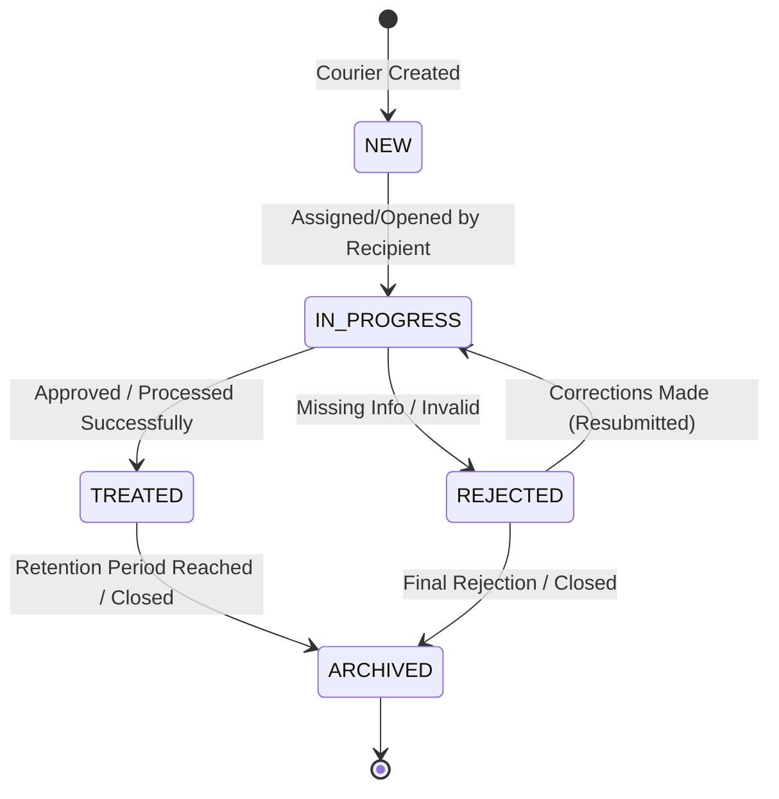
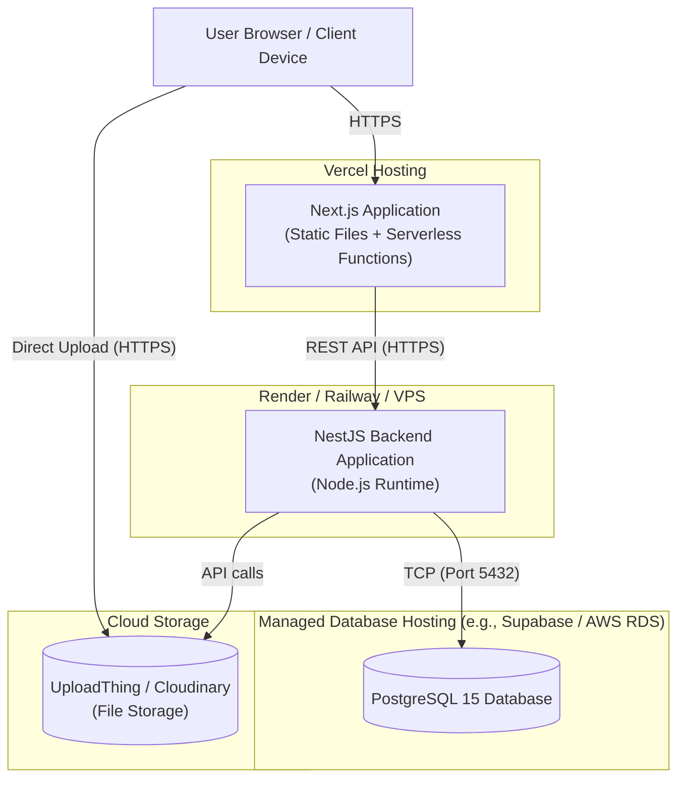

# UML Diagrams: Internal Mail Management System - EST Sidi Bennour

This document contains professional UML diagrams for the final year engineering project (PFE) detailing the architecture and workflow of the Internal Mail Management System.

## 1. Use Case Diagram

This diagram shows the main actors and their interactions with the system.

```mermaid
usecaseDiagram
    actor "SUPER_ADMIN" as sa
    actor "ADMIN" as ad
    actor "CHEF" as ch
    actor "AGENT" as ag
    actor "AUDITOR" as au

    rectangle "Internal Mail Management System" {
        usecase "Login / Authenticate" as UC1
        usecase "Manage Users & Entities" as UC2
        usecase "Create New Courier" as UC3
        usecase "Consult Couriers" as UC4
        usecase "Process / Change Courier State" as UC5
        usecase "Upload/Download Attachments" as UC6
        usecase "View Audit Logs & Stats" as UC7
    }

    sa --> UC1
    sa --> UC2
    sa --> UC4
    sa --> UC7

    ad --> UC1
    ad --> UC4
    ad --> UC7

    ch --> UC1
    ch --> UC3
    ch --> UC4
    ch --> UC5

    ag --> UC1
    ag --> UC3
    ag --> UC4
    ag --> UC5
    ag --> UC6

    au --> UC1
    au --> UC4
    au --> UC7
```

*Note: Use case diagrams in Mermaid are experimental, here is a flowchart representation of the Use Case diagram instead for better compatibility:*



## 2. Class Diagram

Defines the core domain entities (User, Entity, Courier, Category, CourierType, Attachment, StateHistory) and their relationships based on the Prisma schema.



## 3. Sequence Diagram

Illustrates the dynamic behavior for core processes (Login, Create Courier, Change Courier State).

### 3.1. Login Process


### 3.2. Create Courier & Upload Attachment


### 3.3. Change Courier State


## 4. Activity Diagram

Shows the workflow pipeline of a Courier moving through various states in the system.



## 5. Component Diagram

Visualizes the structural components of the full-stack architecture.

```mermaid
flowchart TD
    subgraph "Frontend Layer (Next.js)"
        UI[UI Components & Pages]
        AuthCtx[Auth Context]
        APIClient[Axios / Fetch Client]
        UI --> AuthCtx
        UI --> APIClient
    end

    subgraph "Backend API Layer (NestJS)"
        Controllers[REST Controllers]
        Guards[JWT Auth Guards & Throttler]
        Services[Business Logic Services]
        Controllers --> Guards
        Controllers --> Services
    end

    subgraph "Data Access Layer (Prisma ORM)"
        PrismaClient[Prisma Client]
        Services --> PrismaClient
    end

    subgraph "External Services"
        DB[(PostgreSQL Database)]
        Storage[(UploadThing / Cloudinary)]
    end

    APIClient -- "HTTP/JSON" --> Controllers
    PrismaClient -- "TCP/IP" --> DB
    Frontend Layer (Next.js) -- "HTTPS Upload" --> Storage
    Backend API Layer (NestJS) -- "HTTPS API" --> Storage
```

## 6. Deployment Diagram

Displays how the system will be deployed to servers in a production environment.


